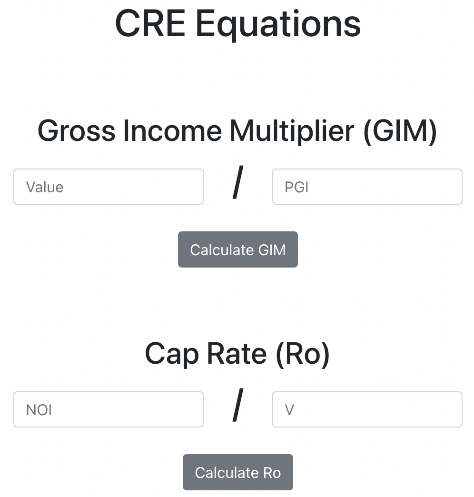

## Basic Commercial Real Estate Equations

This project includes ten basic commercial real estate equations. The equations included are from a financial analysis course by the CCIM Institute. Equations are those that real estate professionals use day-to-day. The equations are not complicated and deal with addition and division. This application is as much a calculator as a way to remember the formulas.

### Features Include:
- User can choose from 10 different real estate equations.
- Equations are not complicated and use simple addition and division.
- Data is saved in Redux state. If the user exits the page, calculations will be lost.

### Technology Used
This web application is purely front-end.  It was built using React, Redux, and Reactstrap.  

### Installation
1. Download directory.
2. Run "yarn start" to start web application.

### Preview

 

